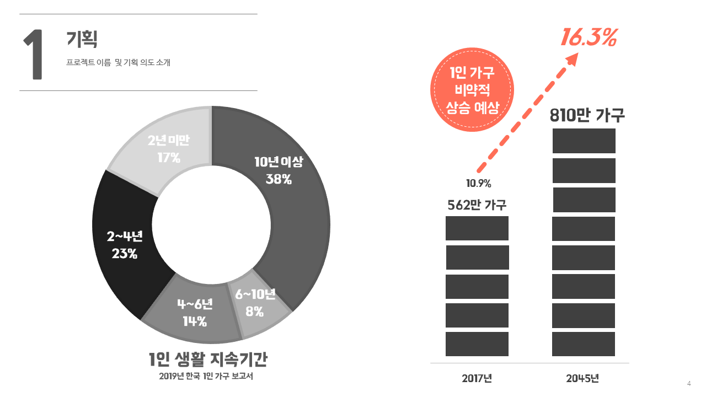

## 맛.zip project


### 1. 프로젝트 목적

   


```
맛.zip 프로젝트는 맛의 알집을 열어서 고객들에게 
음식 레시피와 냉장고 관리법, 장보기 메모 등의 기능을 제공하고자 하였습니다.
```
---


### 2. 프로젝트 타겟층
---




```
프로젝트의 타겟층은 1인 가구를 대상으로 하였습니다. 
물론 남녀노소 모두 이용할 수 있는 서비스이지만 
주로 이용하는 고객층은 1인 가구가 될 것입니다. 
위의 자료 조사를 바탕으로 기획하게 되었습니다.
```
---
### 3. 프로젝트 기여도

```
총 4인 프로젝트로 진행하였고 저는 냉장고 관리 페이지의 프론트 엔드를 담당하였습니다.
```
---
### 4. 냉장고 관리 페이지 기능
```
식재료 찾기
식재료 재고 확인
식재료 정보 전달
식재료 준비 리스트 작성
```
